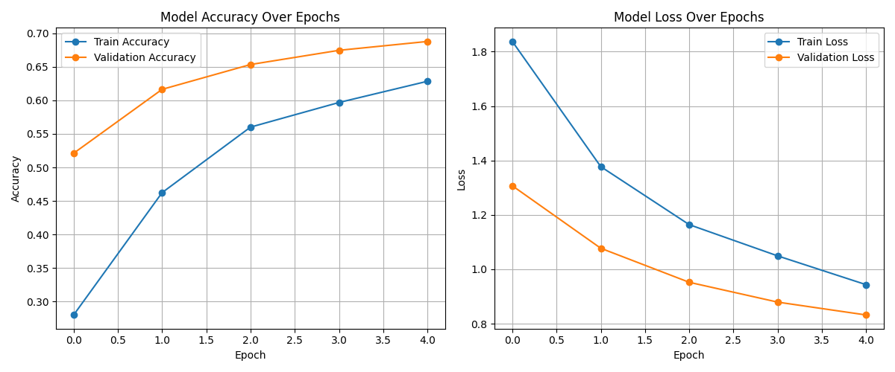
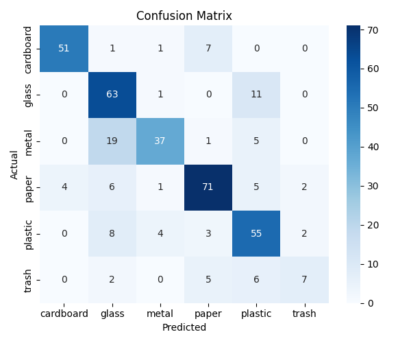
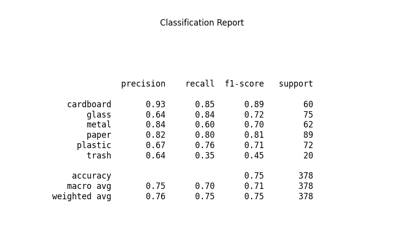

# Garbage-Classification
# 🗑️ Garbage Classification using Deep Learning

A deep learning-based image classification project to automatically identify and categorize garbage into distinct types such as **Plastic**, **Paper**, **Glass**, **Metal**, **Organic**, and **Others**.

---

## 📌 Problem Statement

Manual waste segregation is time-consuming and prone to errors. This project aims to build an automated image classification model to assist in accurate waste identification, promoting better waste management and environmental sustainability.

---

## 🎯 Learning Objectives

- Understand the role of image classification in smart waste management.
- Preprocess and analyze image datasets effectively.
- Apply CNN and transfer learning techniques to real-world classification problems.
- Evaluate model performance using accuracy, confusion matrix, and classification report.

---

## 🛠️ Tools & Technologies Used

- **Language:** Python  
- **Libraries & Frameworks:**
  - TensorFlow / Keras (Modeling)
  - NumPy, Pandas (Data handling)
  - Matplotlib, Seaborn (Visualization)
  - Scikit-learn (Evaluation)
- **Model:** Custom CNN & MobileNetV2 (Transfer Learning)
- **Environment:** Jupyter Notebook / VS Code
- **Dataset Source:** [Kaggle - Trash Type Dataset](https://www.kaggle.com/datasets/farzadnekouei/trash-type-image-dataset)

---

## 🧪 Methodology

1. **Data Collection:** Used a labeled garbage dataset from Kaggle.
2. **Exploratory Data Analysis:** Visualized class distribution and sample images.
3. **Data Preprocessing:**
   - Resized images to 224x224
   - Normalized pixel values
   - Augmented training data
   - Split into Train (70%), Validation (15%), and Test (15%)
4. **Model Development:**
   - Built baseline CNN
   - Applied MobileNetV2 with transfer learning for improvement
5. **Evaluation:** Measured performance using accuracy, classification report, and confusion matrix.

---

## 📊 Results

- Achieved high classification accuracy on unseen test data.
- Visualizations include training curves, confusion matrix, and class-wise performance metrics.

   
  <em>Accuracy & Loss Over Epochs</em>

   
  <em>Confusion Matrix</em>

   
  <em>Classification Report</em>

---

## ✅ Conclusion

The project demonstrates that deep learning techniques such as CNN and transfer learning can effectively classify garbage into categories. It lays a solid foundation for integrating AI into real-world waste management systems and supports the development of automated environmental solutions.

---
